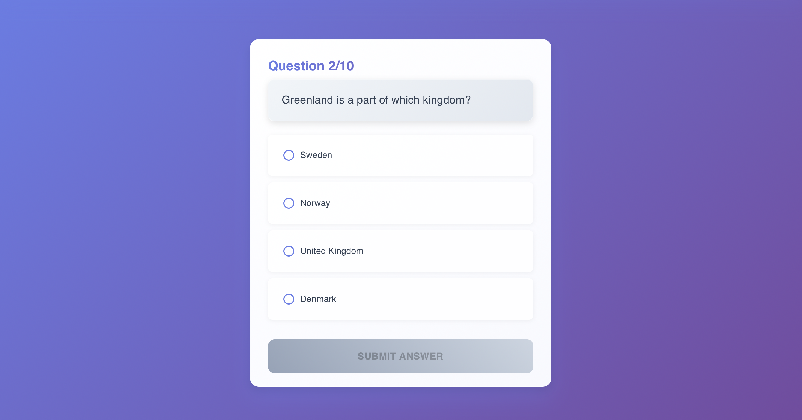

# mern-quiz-app

A full-stack quiz-solving web application built with the MERN stack (MongoDB, Express, React, Node.js).  
Users can register, log in (including via Google), take timed quizzes, and view their performance on a leaderboard.

---

## Features

- User authentication (email and Google login)
- 10 random questions per quiz, pulled from a local database based on Open Trivia API
- Backend-controlled time tracking for each question
- Grade and score calculations are securely handled on the server
- Leaderboard showing the top quiz results
- Responsive user interface suitable for both desktop and mobile devices

---

## Scoring Logic

Each question’s score is calculated using the formula:

**score = 100 × grade × e^(-0.2 × time)**

Where:

- **grade** is a value between 0 and 1 depending on how correct the answer is  
- **time** is the number of seconds the user took to answer (measured on the backend)  
- **e** is Euler’s number (approximately 2.71828)

The final quiz score is the sum of all question scores.

---

## Tech Stack

### Frontend
- React
- React Router
- Context API

### Backend
- Node.js
- Express
- Passport.js (Google OAuth2)

### Database
- MongoDB
- Mongoose

---

## Security Notes

- Score and grade are calculated only on the backend
- Correct answers are never sent to the frontend
- Timing is measured on the server side to prevent cheating

---

## Screenshots

### Login

### Dashboard

### Quiz

